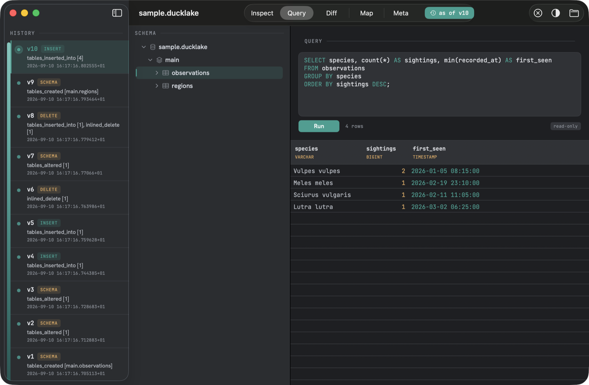
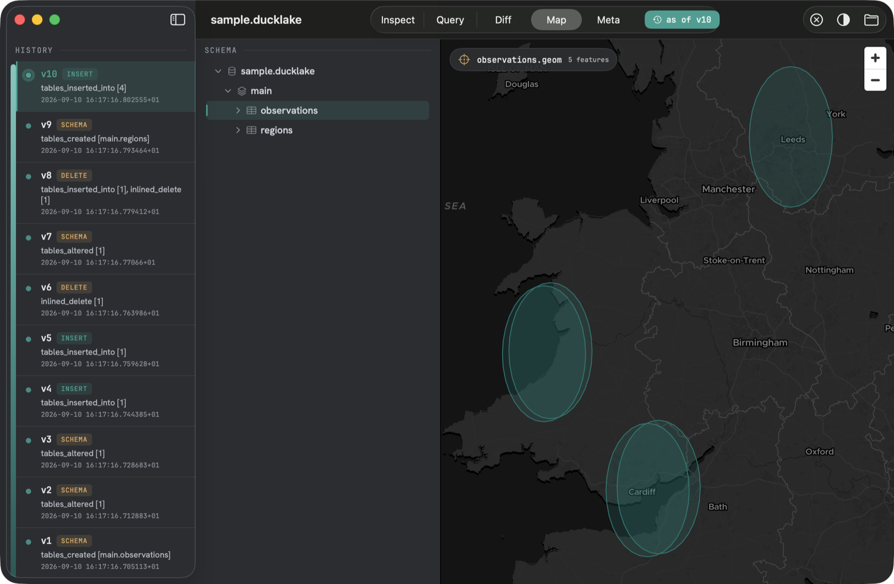
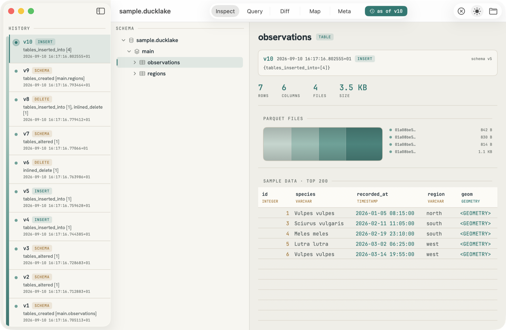
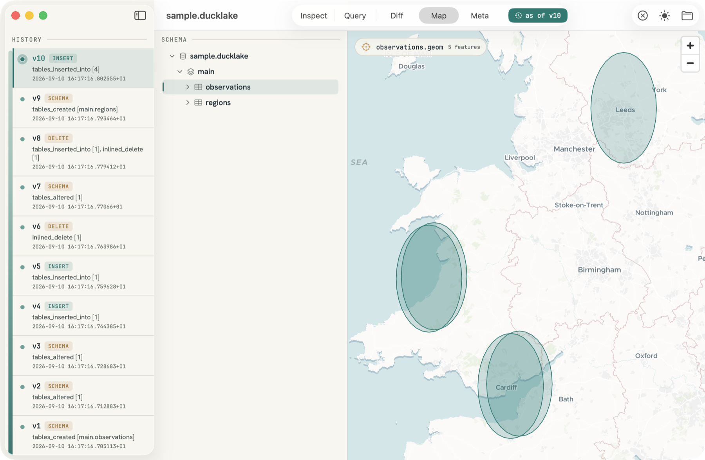

# DuckLake Explorer

**Read your DuckLake down to the bedrock** — a native macOS app for exploring a
[DuckLake](https://ducklake.select) lakehouse read-only: its schema, its snapshots and
time-travel, the physical Parquet strata, and an ad-hoc SQL workbench. It never writes a byte.


DuckLake keeps a lakehouse's catalog in a plain SQL database and its data in Parquet files.
DuckLake Explorer opens that catalog — DuckDB- or SQLite-backed, sitting on your disk or on S3 —
links the local `libduckdb` in-process, and gives you a fast native window onto it. No server,
no notebook, no chance of changing anything.

## What's inside

- **Snapshot history & time-travel.** Every commit is a layer in the core down the left rail.
  Click one and read the entire lake *as of* that version — schema, files, and data all follow.
- **The table, physically.** Row / column / file / size metrics, the Parquet files laid out as
  strata, and a live sample of the rows. The metrics come from the catalog, so they're there
  even when the data itself lives on S3.
- **A read-only SQL workbench.** Syntax highlighting, schema-aware, results streamed into a grid
  that stays smooth at a million rows. Writes are *refused*, not just discouraged.
- **The metadata is data.** Browse the raw `ducklake_*` catalog tables themselves, grouped by
  what they describe — snapshots, schema, data files, statistics.
- **Geometry on a map.** Geometry columns render as features on a MapLibre basemap that
  follows the app's appearance — light tiles for light chrome, dark for dark.
- **Snapshot diff.** Pick two versions; see exactly what changed between them.

<table>
  <tr>
    <td width="50%"></td>
    <td width="50%"></td>
  </tr>
  <tr>
    <td align="center"><em>Read-only SQL workbench</em></td>
    <td align="center"><em>Geometry on a basemap that matches the theme</em></td>
  </tr>
</table>


The interface — *Stratum* — reads a lake the way you'd read a geological core: a water-depth
palette from surface to bedrock, the snapshot log as the core spine, and each Parquet file a
band of sediment. Columns are coloured by type; numbers sit right-aligned in brass, geometry
and booleans in teal.

Light or dark, the whole thing follows suit — chrome, grid, and basemap included:

<table>
  <tr>
    <td width="50%"></td>
    <td width="50%"></td>
  </tr>
</table>

## Prerequisites

- macOS 26+ (Tahoe) — the app's deployment target; building needs Xcode 26.
- Homebrew `duckdb`, which provides `libduckdb.dylib` + headers: `brew install duckdb`.
- `brew install xcodegen`.

## Build & run

```sh
# Engine layer — fast, headless:
swift test

# Generate and build the app:
xcodegen generate
xcodebuild -project DuckLakeExplorer.xcodeproj -scheme DuckLakeExplorer build
open ~/Library/Developer/Xcode/DerivedData/DuckLakeExplorer-*/Build/Products/Debug/"DuckLake Explorer.app"
```

The `.xcodeproj` is generated (gitignored); edit `project.yml` and re-run `xcodegen generate`.
There's a committed synthetic lake at `Fixtures/sample.ducklake` — open it for a first look.

## Map basemap (MapTiler key)

The Map view renders [MapLibre GL](https://maplibre.org) tiles from
[MapTiler](https://www.maptiler.com), which needs an API key. **No key is committed.** To
render tiles, drop yours into an untracked config and regenerate:

```sh
echo 'MAPTILER_API_KEY = your_maptiler_key' > Config/maptiler.local.xcconfig
xcodegen generate
```

`Config/maptiler.local.xcconfig` is gitignored; the key flows `MAPTILER_API_KEY` →
`Info.plist` (`MapTilerAPIKey`) at build time → `MapConfig.swift` at runtime. Without a key the
app runs fine — the basemap tiles just don't load.

## How it's built

- `Sources/CDuckDB`, `Sources/DuckDBKit` — the engine layer: a small Swift package wrapping the
  locally-installed `libduckdb` (Homebrew, v1.5.5) via its C API, decoding result chunks
  column-by-column. Headless-testable with `swift test`.
- `Sources/App`, `project.yml` — the SwiftUI macOS app (Xcode project generated by XcodeGen).
  The hot paths — the results grid and SQL editor — drop to AppKit (`NSTableView`, `NSTextView`)
  so they stay fast on large results; the map is a `WKWebView` running MapLibre GL.
- `Fixtures/` — a committed synthetic lake (wildlife sightings) used by the tests and for a
  first look.

See **[SPEC.md](./SPEC.md)** for the design and **[MILESTONES.md](./MILESTONES.md)** for where
it's headed.

> Read-only by design: the catalog is attached `READ_ONLY`, DML/DDL is rejected before it
> reaches the engine, and there are no DuckLake maintenance operations. It reads; it doesn't touch.
